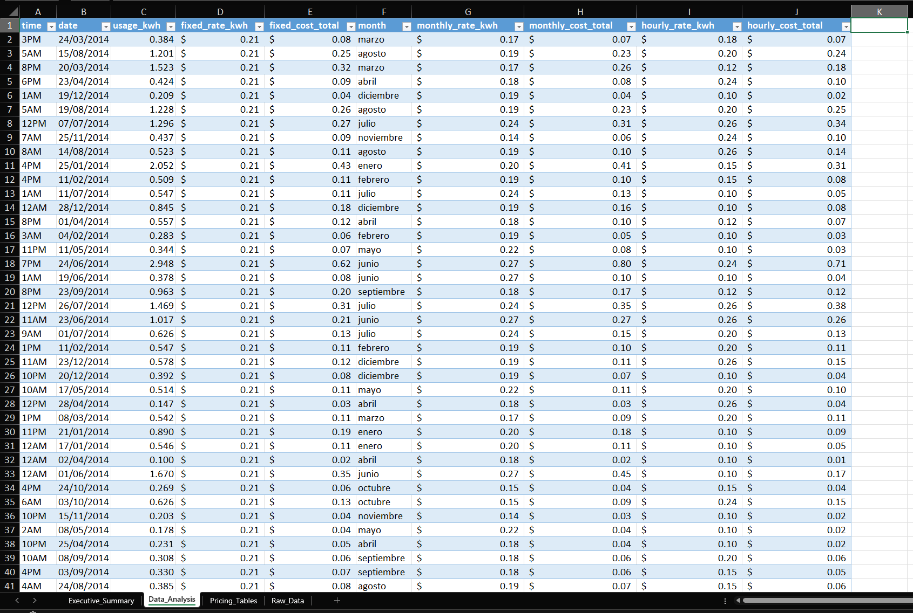
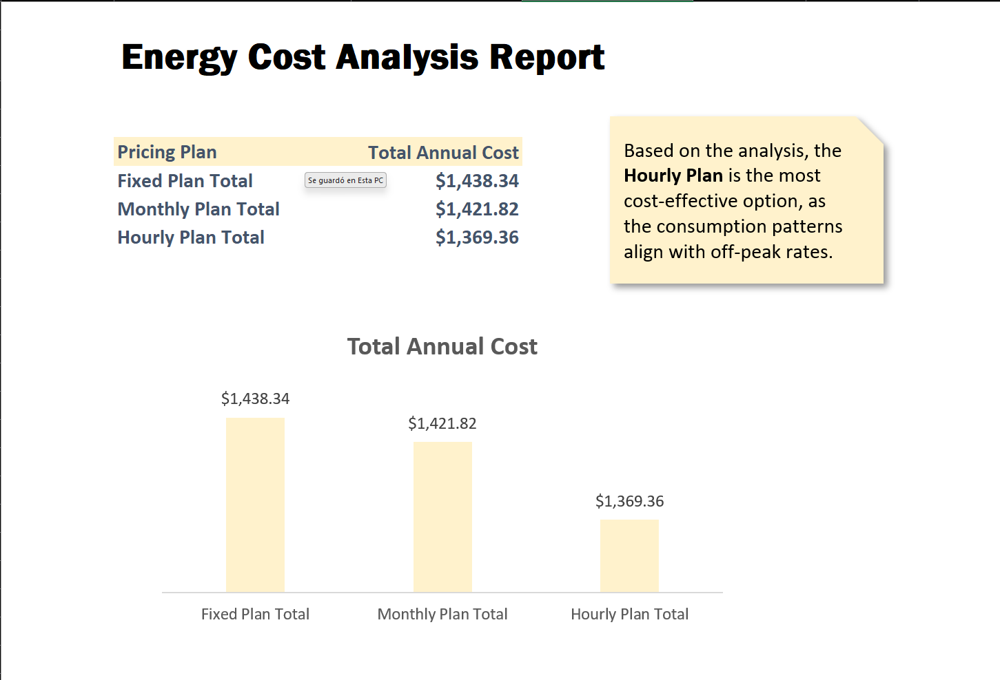

# 📊 Energy Cost Optimization Model

### 📌 Project Objective
This project analyzes annual energy consumption to determine the most cost-effective electricity plan among three options: Fixed, Monthly, and Hourly rates. The goal is to identify savings opportunities based on real consumption patterns.

---

### 🧩 The Challenge: Data Transformation
The source data consisted of non-structured text strings. I developed a comprehensive **Data Cleaning Pipeline** in Excel to normalize the information:

1.  **String Cleansing:** Used nested functions to remove delimiters, irregular spaces, and non-numeric characters.
2.  **Pattern Extraction:** Isolated dates, times, and energy usage (kWh) from complex text blocks.
3.  **Data Standardization:** Converted raw text into a structured format ready for financial modeling.

*(Preview: Transformation from `Raw Data Input` to structured columns)*

---

### 🔧 Financial Modeling & Logic
Once the data was clean, I built a calculation engine to simulate the costs under three different pricing structures using logical functions and matrix lookups.

*(Financial model comparing the three tariff scenarios)*

---

### 📈 Key Insights & Dashboard
The analysis revealed that the **Hourly Plan** is the most profitable option for this user, offering the lowest annual cost. This is because the user's highest consumption occurs during off-peak hours when electricity is cheapest ($0.10 - $0.12/kWh).

*(Executive Dashboard with final recommendation)*

### 🧠 Conclusion
This project demonstrates how technical data cleaning is the foundation of business intelligence. Converting "dirty" data into a structured model allows for precise operational cost optimization.
